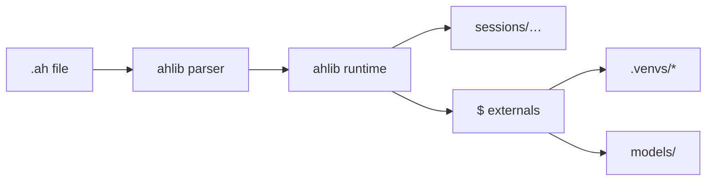

# Anthill

Anthill is designed to help you build agentic systems on your own computer — privately, locally, and under your full control.

The model is intentionally straightforward: you define **contexts** and connect them through **actions** that transform data from one step to the next. Each action may call an appropriate model for the task at hand, whether you are working with text, audio, images, music, or video.

For advanced generative pipelines, Anthill offers flexible integration with **ComfyUI**, so you can incorporate the full range of community workflows alongside built-in externals.

**The purpose of this project** is to bring together the capabilities of modern open models on your local machine — so you can compose powerful media pipelines without depending on hosted services.

Programs are written in **`.ah` files**: a small declarative language interpreted by `ahlib`, with GPU-heavy steps running in isolated environments when needed.

## Demo

Sample output from [`examples/example_animated_clip_with_comfy.ah`](examples/example_animated_clip_with_comfy.ah) — LLM prompts → still images → ComfyUI animation → ACE-Step music → final clip.

*Unmute the player for audio.*

https://github.com/skreling-eng/anthill/releases/download/_gh-attach-assets/0000_20260526_023714_video_clip_0_readme.mp4

<p align="center">
  <video
    src="https://github.com/skreling-eng/anthill/releases/download/_gh-attach-assets/0000_20260526_023714_video_clip_0_readme.mp4"
    controls
    width="720"
    playsinline
  >
    <a href="https://github.com/skreling-eng/anthill/releases/download/_gh-attach-assets/0000_20260526_023714_video_clip_0_readme.mp4">Play sample output (MP4)</a>
  </video>
</p>

<p align="center">
  <a href="https://github.com/skreling-eng/anthill/releases/download/_gh-attach-assets/0000_20260526_023714_video_clip_0_readme.mp4">
    
  </a>
</p>

Full-quality file in the repo: [`test_data/clip/0000_20260526_023714_video_clip_0.mp4`](test_data/clip/0000_20260526_023714_video_clip_0.mp4) (~38&nbsp;MB). Requires local models, ComfyUI on port `8000`, and `comfy_workflows/Rapid-AIO-Mega__3_start_image.json`.

### Pipeline source (`example_animated_clip_with_comfy.ah`)

```ah
### Images

@good_quality_image
High Angle Shot, High Resolution, Best Quality, best quality,score_9, score_8_up, score_7_up

@realistic
realistic, photorealistic, hyperrealistic,

@high_angle_shot
high-angle shot, camera looking down

@blond_woman: @good_quality_image -> @high_angle_shot
1girl, blonde with green eyes

@topic
The detailed portrait of the witch

@rand_prompt: @topic -> $llm[3] -> $texts_to_prompts -> @blond_woman
Create a prompt for an image generation model to produce a high-quality image.
Use no more than 55 words.
Return only the final result without comments, clarifications, or descriptions.

@images: @rand_prompt -> $image(model='realitsic_fantasy', width=768, height=1280)[10]

### Music

@style
Irish traditional song, strong female voice

@lyrics_text: $llm
Create a short song about a witch who wants to take your soul.
Return only the final result without comments, clarifications, or descriptions.

@track: (@style, @lyrics_text) -> $music(model='st', guidance_scale=4.0, vocal_language='en', inference_steps=50)

### Video

@video_prompt: $llm -> $texts_to_prompts
Create a prompt for a video generation model.
Animate the portrait image of the witch.
Use no more than 55 words.
Return only the final result without comments, clarifications, or descriptions.

@realistic_video: @video_prompt -> $comfy(port=8000, json='Rapid-AIO-Mega__3_start_image.json')[4]

@video_fragments: @images -> @realistic_video

### Clip

@gen_clip: (@video_fragments, @track) -> $video_clip -> $output

run @gen_clip
```

```powershell
uv run python run_ah.py examples\example_animated_clip_with_comfy.ah
```

---


## How it works

Programs are **instructions** (`@name`) connected by **`->`**. Data flows as seven parallel arrays (prompts, texts, images, sounds, videos, files, and pending changes). **Externals** (`$image`, `$music`, `$llm`, …) are Python handlers under `externals/`; heavy ones run in dedicated venvs (`.venvs/media`, `.venvs/music`, …) so conflicting PyTorch stacks never share one environment.



Each external call writes `input.json`, `invoke.json`, and `output.json` under the session so runs are inspectable and replayable.

---

## Requirements

- **Windows** (primary target; paths and setup scripts assume it)
- **Python 3.11** (3.12 not supported — see `pyproject.toml`)
- **[uv](https://docs.astral.sh/uv/)** for dependency management
- **NVIDIA GPU** recommended for `$image`, `$image2video`, `$music`, and related externals
- **Model weights** under `models/` (not in this repo — see [Models](#models))

---

## Quick start

### 1. Clone and install base runtime

```powershell
git clone https://github.com/YOUR_USER/anthill.git
cd anthill
uv sync
```

### 2. Create external venvs (once)

GPU/media stacks are isolated on purpose (e.g. ACE-Step vs diffusers torch versions conflict if merged).

```powershell
powershell -ExecutionPolicy Bypass -File tools\setup_external_venvs.ps1
```

Copy the printed `AH_EXTERNAL_VENV_*` lines into `.env` (see `.env` in the repo for Wan/Kokoro examples). Optional: SageAttention wheels for faster `$image2video`:

```powershell
$env:UV_PROJECT_ENVIRONMENT = ".venvs/media"
powershell -File tools\setup_sage_windows.ps1
```

### 3. Add models

Weights live in `models/<family>/`. Each family may have a short README (e.g. `models/wan/README.md`, `models/kokoro/README.md`). Download or snapshot Hugging Face assets into those paths before running pipelines that need them.

### 4. Run an example

```powershell
uv run python run_ah.py examples\example_simple_image_generation.ah
# or
.\run.bat
```

`run.bat` expects `.venvs\media` and runs `example.ah` by default. Session output appears under `sessions/<timestamp>_…/`.

---

## Language cheat sheet

| Syntax | Meaning |
|--------|---------|
| `@name: a -> b` | Instruction pipeline |
| `run @name` | Entry point |
| `$image(model='x')[n]` | External call; optional repeat |
| `(@a, @b)` | Parallel branches, arrays joined |
| `for(filter){ … }` | Partition by filter, process matches |
| `zip(images, texts){ … }` | Per-index slice |
| `%ctx` / `ctx%` | Session-scoped bundle storage |

Full reference: [`_lang_desc`](_lang_desc) (data model, context rules, changes array, emulation flags).

---

## Externals

Handlers live in `externals/<name>/` with a `run.py` entry point.

| External | Role |
|----------|------|
| `$file`, `$folder`, `$save`, `$output` | Load / write session files |
| `$llm` | Local LLM (llama.cpp) |
| `$texts_to_prompts`, `$prompts_to_texts` | Prompt ↔ text conversion |
| `$image`, `$image2image`, `$image_variation` | Image generation (diffusers) |
| `$image2video` | Wan-based image → video |
| `$comfy` | ComfyUI API workflows (`comfy_workflows/`) |
| `$music`, `$music_separation`, `$join_stems` | Music gen / stem split |
| `$text2speech`, `$voice_enhance`, `$change_voice` | TTS / enhance / RVC |
| `$image_clip`, `$video_clip`, `$clip` | Slideshow / mux video |
| `$sound2text` | Whisper transcription |
| `$draw_text` | Text overlay on images |
| `$only`, `$select`, `$clear`, `$check_image` | Bundle utilities |
| `$list`, `$first_image`, `$input_json` | Lists and replay helpers |

Prompt-consuming externals clear `prompts[]` after they run. Tests can emulate handlers with `AH_EMULATE_*=1`.

---

## Examples

| File | Focus |
|------|--------|
| [`example.ah`](example.ah) | LLM → image → clip; music; image2video snippets |
| [`examples/example_simple_image_generation.ah`](examples/example_simple_image_generation.ah) | Multi-model `$image` + `$draw_text` |
| [`examples/example_image_clip.ah`](examples/example_image_clip.ah) | Image slideshow + audio |
| [`examples/example_animated_clip_with_comfy.ah`](examples/example_animated_clip_with_comfy.ah) | ComfyUI animation |
| [`examples/example_text2speech.ah`](examples/example_text2speech.ah) | Kokoro TTS |
| [`examples/example_music_to_stems.ah`](examples/example_music_to_stems.ah) | Stem separation |
| [`examples/example_replace_voice.ah`](examples/example_replace_voice.ah) | RVC voice change |

---

## Project layout

```
anthill/
├── ahlib/              # Parser, runtime, action executor
├── externals/          # $ handlers (one folder per external)
├── examples/           # Sample .ah programs
├── test_data/clip/     # Sample outputs for the README
├── comfy_workflows/    # ComfyUI JSON workflows
├── models/             # Local weights (gitignored; README stubs only)
├── sessions/           # Run artifacts (gitignored)
├── tools/              # Setup: venvs, GPU torch, model downloads
├── tests/              # pytest suite
├── run_ah.py           # CLI entry
├── pyproject.toml      # Base deps + optional extras
└── _lang_desc          # .ah language reference
```

---

## Models

Code resolves paths relative to the repo root, e.g. `models/kokoro/`, `models/wan/i2v-base/`, `models/rvc/<voice>/`. Override with environment variables where documented (`WAN_I2V_BASE_DIR`, `AH_KOKORO_DIR`, `ACESTEP_CHECKPOINTS_DIR`, …).

**This repository does not ship weights.** Host them on [Hugging Face](https://huggingface.co) (or pull from upstream repos) and mirror the layout under `models/`, or point env vars at another directory. See per-family READMEs under `models/` for download commands.

Upstream examples already wired in docs:

- Wan I2V aux — `Wan-AI/Wan2.1-I2V-14B-480P-Diffusers` → `models/wan/i2v-base/`
- Kokoro TTS — `hexgrad/Kokoro-82M` → `models/kokoro/`
- Resemble Enhance — `ResembleAI/resemble-enhance` → `models/resemble-enhance/`

---

## Development

```powershell
uv sync
uv run pytest
uv run python run_ah.py example.ah --dump-parse   # inspect parsed program JSON
```

Optional extras in `pyproject.toml`: `clip`, `sound2text`, `music`, `image`, `image2video`, `media`, etc. Do not install `music` and `media` in the same uv environment — conflicts are declared in `[tool.uv.conflicts]`.

Subprocess vs in-process externals: `AH_EXTERNAL_SUBPROCESS`, `AH_EXTERNAL_INPROCESS` (see `_lang_desc` §6).

---

## Configuration

- **`.env`** — loaded by `run_ah.py` (venv paths, Wan dirs, ACE-Step backend, …). Never commit secrets.
- **ComfyUI** — run Comfy separately; `$comfy(port=…, json='…')` targets `comfy_workflows/`.
- **LLM** — place GGUF under `models/llm/` for `$llm`.

---

## License

Application source in this repo: *license TBD — add a `LICENSE` file when you publish.*

Model checkpoints and third-party weights retain their original licenses (FLUX, Wan, Kokoro, RVC datasets, etc.). Only redistribute weights you are allowed to host.
