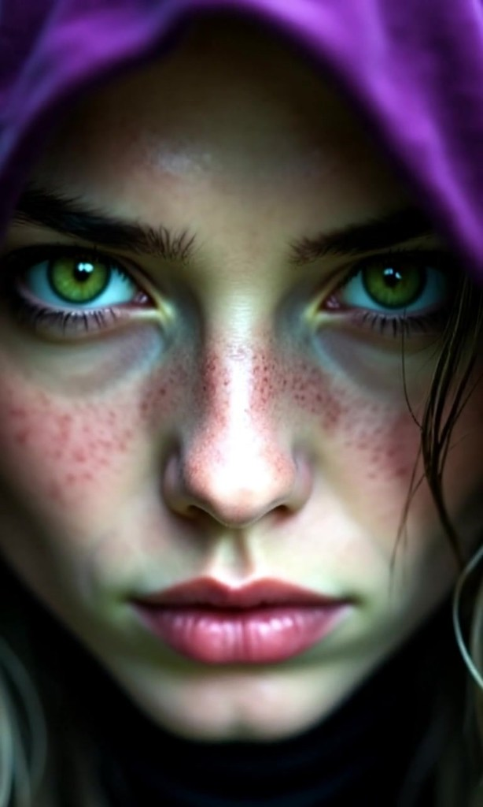
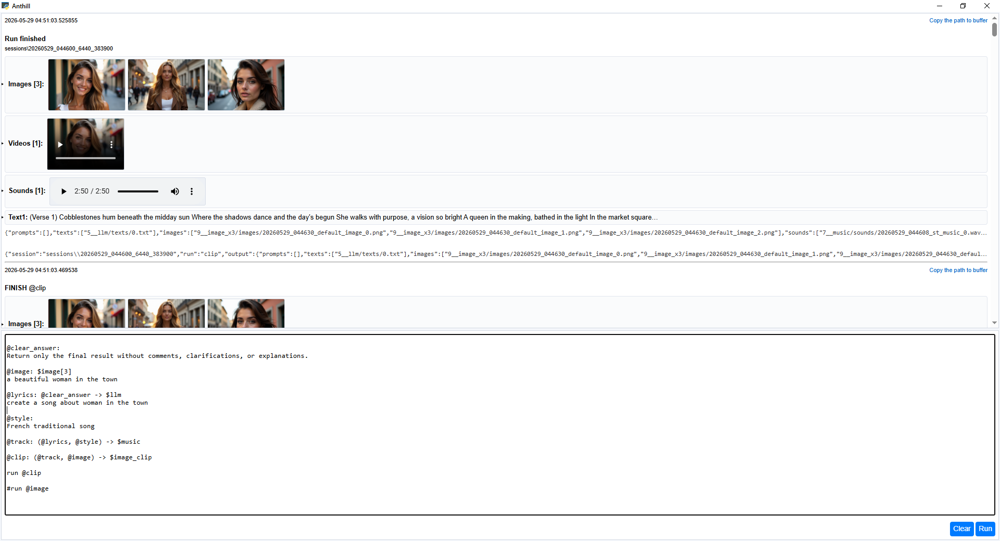
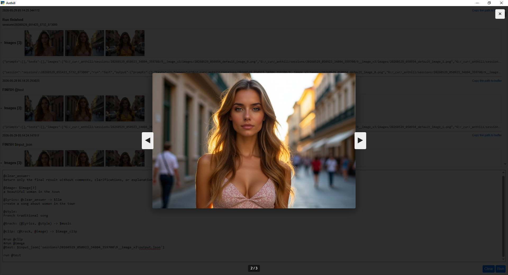
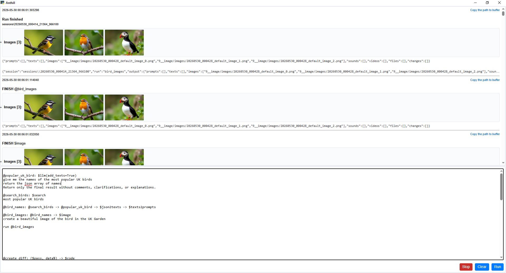
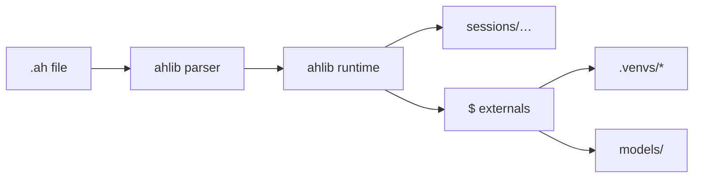

# Anthill

Anthill is designed to help you build agentic systems on your own computer — privately, locally, and under your full control.

The model is intentionally straightforward: you define **contexts** and connect them through **actions** that transform data from one step to the next. Each action may call an appropriate model for the task at hand, whether you are working with text, audio, images, music, or video.

For advanced generative pipelines, Anthill offers flexible integration with **ComfyUI**, so you can incorporate the full range of community workflows alongside built-in externals.

**The purpose of this project** is to bring together the capabilities of modern open models on your local machine — so you can compose powerful media pipelines without depending on hosted services.

Programs are written in **`.ah` files**: a small declarative language interpreted by `ahlib`, with GPU-heavy steps running in isolated environments when needed.

## Demo

Sample output from [`examples/example_animated_clip_with_comfy.ah`](examples/example_animated_clip_with_comfy.ah) — LLM prompts → still images → ComfyUI animation → ACE-Step music → final clip.

Click to open the video.

<p align="center">
  <a href="https://github.com/skreling-eng/anthill/releases/download/_gh-attach-assets/0000_20260526_023714_video_clip_0_readme.mp4">
    
  </a>
</p>

https://github.com/skreling-eng/anthill/releases/download/_gh-attach-assets/0000_20260526_023714_video_clip_0_readme.mp4

Full-quality file in the repo: [`test_data/clip/0000_20260526_023714_video_clip_0.mp4`](test_data/clip/0000_20260526_023714_video_clip_0.mp4) (~38&nbsp;MB). Requires local models, ComfyUI on port `8000`, and `comfy_workflows/Rapid-AIO-Mega__3_start_image.json`.

### Pipeline source (`example_animated_clip_with_comfy.ah`)

```ah
### Images

@good_quality_image
High Angle Shot, High Resolution, Best Quality, best quality,score_9, score_8_up, score_7_up

@realistic
realistic, photorealistic, hyperrealistic,

@high_angle_shot
high-angle shot, camera looking down

@blond_woman: @good_quality_image -> @high_angle_shot
1girl, blonde with green eyes

@topic
The detailed portrait of the witch

@rand_prompt: @topic -> $llm[3] -> $texts_to_prompts -> @blond_woman
Create a prompt for an image generation model to produce a high-quality image.
Use no more than 55 words.
Return only the final result without comments, clarifications, or descriptions.

@images: @rand_prompt -> $image(model='realitsic_fantasy', width=768, height=1280)[10]

### Music

@style
Irish traditional song, strong female voice

@lyrics_text: $llm
Create a short song about a witch who wants to take your soul.
Return only the final result without comments, clarifications, or descriptions.

@track: (@style, @lyrics_text) -> $music(model='st', guidance_scale=4.0, vocal_language='en', inference_steps=50)

### Video

@video_prompt: $llm -> $texts_to_prompts
Create a prompt for a video generation model.
Animate the portrait image of the witch.
Use no more than 55 words.
Return only the final result without comments, clarifications, or descriptions.

@realistic_video: @video_prompt -> $comfy(port=8000, json='Rapid-AIO-Mega__3_start_image.json')[4]

@video_fragments: @images -> @realistic_video

### Clip

@gen_clip: (@video_fragments, @track) -> $video_clip -> $output

run @gen_clip
```

```powershell
uv run python run_ah.py examples\example_animated_clip_with_comfy.ah
```

---

## Desktop app

Anthill includes a **desktop UI** ([`app.py`](app.py), [pywebview](https://pywebview.flowrl.com/)): edit `.ah` scripts in the lower pane, click **Run**, and follow progress in the action log. Finished runs show inline **image**, **video**, and **audio** previews, expandable JSON, and links to copy session paths for replay with `$input_json`.

```powershell
uv run python app.py
# or:  app_start.bat
```

**Script editor and run log** — `$image`, `$music`, `$image_clip` in one session; thumbnails, video player, and lyrics in the log.

<p align="center">
  
</p>

**Image lightbox** — click a thumbnail to browse generated images full-size.

<p align="center">
  
</p>

**Pipeline example** — [`examples/example_search.ah`](examples/example_search.ah): `$search` → `$llm` → `$image` (UK garden birds).

<p align="center">
  
</p>

---


## How it works

Programs are **instructions** (`@name`) connected by **`->`**. Data flows as seven parallel arrays (prompts, texts, images, sounds, videos, files, and pending changes). **Externals** (`$image`, `$music`, `$llm`, …) are Python handlers under `externals/`; heavy ones run in dedicated venvs (`.venvs/media`, `.venvs/music`, …) so conflicting PyTorch stacks never share one environment. When a run finishes, Anthill releases GPU memory (warm workers and CUDA cache) unless you opt out with `AH_RELEASE_GPU_ON_RUN_END=0`.



Each external call writes `input.json`, `invoke.json`, and `output.json` under the session so runs are inspectable and replayable.

---

## Requirements

- **Windows** (primary target; paths and setup scripts assume it) or **Linux** (use `tools/init.sh`; GPU externals need NVIDIA + CUDA drivers)
- **Python 3.11–3.12** (`>=3.11,<3.13` in `pyproject.toml`)
- **[uv](https://docs.astral.sh/uv/)** for dependency management
- **[Hugging Face CLI](https://huggingface.co/docs/huggingface_hub/guides/cli)** (`hf`) for model downloads
- **NVIDIA GPU** recommended for `$image`, `$image2video`, `$music`, and related externals
- **Model weights** under `models/` (not in this repo — see [Models](#models))

---

## Quick start

### 1. Clone and run init (recommended)

One script installs base + external venvs. Model weights are downloaded separately from [skreling-eng/anthill](https://huggingface.co/skreling-eng/anthill):

**Windows**

```powershell
git clone https://github.com/YOUR_USER/anthill.git
cd anthill
powershell -ExecutionPolicy Bypass -File tools\init.ps1
# or:  init.bat
```

**Linux**

```bash
git clone https://github.com/YOUR_USER/anthill.git
cd anthill
bash tools/init.sh
# or:  chmod +x init && ./init
```

Init options: `-SkipSage`, `-SkipVenvs` on Windows; `--skip-sage`, `--skip-venvs` on Linux. Then download **models/** and **test_data/**:

```powershell
download_all_models.bat
# or:  download_all_models.bat -Profile minimal -UpstreamFallback
```

```bash
bash tools/download_all_models.sh
```

Download options: `-Profile minimal|standard|full`, `-SkipTestData`, `-UpstreamFallback`, `-DryRun`. Maintainers publish to the Hub: `uv run python tools/upload_to_hf.py --token hf_...` (models + test_data), or `init.bat -UploadTestData` (test_data only). Status: `uv run python tools/download_models.py --status`.

### 2. Manual setup (alternative)

```powershell
uv sync
powershell -ExecutionPolicy Bypass -File tools\setup_external_venvs.ps1
uv run python tools\download_models.py
```

Copy the printed `AH_EXTERNAL_VENV_*` lines into `.env` (or use `.env.template`). Optional SageAttention for faster `$image2video`:

```powershell
$env:UV_PROJECT_ENVIRONMENT = ".venvs/media"
powershell -File tools\setup_sage_windows.ps1
```

### 3. Models

Weights live in `models/<family>/`. Example images, audio, and clips live under `test_data/` (mostly gitignored; init pulls them from the same [anthill](https://huggingface.co/skreling-eng/anthill) bundle as `test_data/**` on the Hub). Optional RVC voices stay under `models/rvc/` if you add them locally.

### 4. Run an example

**CLI**

```powershell
uv run python run_ah.py examples\example_simple_image_generation.ah
# or
.\run.bat
```

**Desktop app**

```powershell
uv run python app.py
```

`run.bat` expects `.venvs\media` and runs `example.ah` by default. Session output appears under `sessions/<timestamp>_…/`.

---

## Language cheat sheet

| Syntax | Meaning |
|--------|---------|
| `@name: a -> b` | Instruction pipeline |
| `run @name` | Entry point |
| `$image(model='x')[n]` | External call; optional repeat |
| `(@a, @b)` | Parallel branches, arrays joined |
| `for(filter){ … }` | Partition by filter, process matches |
| `zip(images, texts){ … }` | Per-index slice |
| `%ctx` / `ctx%` | Session-scoped bundle storage |

Full reference: [`_lang_desc`](_lang_desc) (data model, context rules, changes array, emulation flags).

---

## Externals

Handlers live in `externals/<name>/` with a `run.py` entry point.

| External | Role |
|----------|------|
| `$file`, `$folder`, `$save`, `$output` | Load / write session files |
| `$llm` | Local LLM (llama.cpp) |
| `$add_gguf_llm_model` | Fetch user GGUF into `models/llm_user/` for `$llm` |
| `$math` | Math-focused LLM (`$llm` + Qwen3.6 UD-Q4_K_M default) |
| `$texts_to_prompts`, `$prompts_to_texts` | Prompt ↔ text conversion |
| `$image` | FLUX / LoRA text-to-image (diffusers) |
| `$image2image` | Qwen-Rapid-AIO prompt-guided edit ([`comfy_lib/`](comfy_lib/), in-process — no Comfy server) |
| `$image2text` | Qwen2-VL / Qwen3-VL-8B vision-language (`model=qwen2` default, `model=qwen3`) |
| `$image2video` | Wan-based image → video |
| `$comfy` | ComfyUI **server** API workflows (`comfy_workflows/`) |
| `$music`, `$music_separation`, `$join_stems` | Music gen / stem split |
| `$text2speech`, `$voice_enhance`, `$change_voice` | TTS / enhance / RVC |
| `$image_clip`, `$video_clip`, `$clip` | Slideshow / mux video |
| `$sound2text` | Whisper transcription |
| `$draw_text` | Text overlay on images |
| `$video_thumbnailer` | Contact-sheet JPEG preview per video |
| `$only`, `$select`, `$clear`, `$check_image` | Bundle utilities |
| `$list`, `$first_image`, `$input_json` | Lists and replay helpers |

Prompt-consuming externals clear `prompts[]` after they run. Tests can emulate handlers with `AH_EMULATE_*=1`.

Per-external docs: `externals/<name>/_description`. Subprocess and GPU lifecycle: [`externals/SUBPROCESS.md`](externals/SUBPROCESS.md).

---

## Examples

| File | Focus |
|------|--------|
| [`example.ah`](example.ah) | LLM → image → clip; music; image2video snippets |
| **Image & vision** | |
| [`examples/example_simple_image_generation.ah`](examples/example_simple_image_generation.ah) | Multi-model `$image` + `$draw_text` |
| [`examples/example_image2image.ah`](examples/example_image2image.ah) | Qwen-Rapid-AIO `$image2image` edit |
| [`examples/example_image2text.ah`](examples/example_image2text.ah) | `$image` → `$image2text` (Qwen2-VL caption) |
| [`examples/example_image2text2.ah`](examples/example_image2text2.ah) | `$image2text` on a file; hand/finger validation prompt |
| [`examples/example_ocr.ah`](examples/example_ocr.ah) | `$image` with poster text → `$ocr` |
| **Video & clip** | |
| [`examples/example_image_clip.ah`](examples/example_image_clip.ah) | Image slideshow + audio |
| [`examples/example_image_clip2.ah`](examples/example_image_clip2.ah) | Multi-model images, `$draw_text`, ACE-Step music → `$image_clip` |
| [`examples/example_video_clip.ah`](examples/example_video_clip.ah) | Mux video folder + WAV with `$video_clip` |
| [`examples/example_combine_data.ah`](examples/example_combine_data.ah) | `$video_clip` → `$output` from test_data |
| [`examples/example_animated_clip_with_comfy.ah`](examples/example_animated_clip_with_comfy.ah) | ComfyUI animation pipeline |
| **Audio & voice** | |
| [`examples/example_text2speech.ah`](examples/example_text2speech.ah) | Kokoro TTS |
| [`examples/example_music_to_stems.ah`](examples/example_music_to_stems.ah) | Stem separation |
| [`examples/example_music_enhance.ah`](examples/example_music_enhance.ah) | Separate vocals → `$voice_enhance` → `$join_stems` |
| [`examples/example_voice_enhance.ah`](examples/example_voice_enhance.ah) | Same enhance/rejoin pattern (alternate sample WAV) |
| [`examples/example_replace_voice.ah`](examples/example_replace_voice.ah) | RVC voice change |
| [`examples/example_replace_voice2.ah`](examples/example_replace_voice2.ah) | `$music` → separate → `$change_voice` (multi model) → enhance |
| [`examples/example_replace_voice3.ah`](examples/example_replace_voice3.ah) | `$text2speech` → RVC → light enhance → rejoin stems |
| **LLM, code & search** | |
| [`examples/example_code.ah`](examples/example_code.ah) | `$code` — generate Python (quick sort) |
| [`examples/example_code2.ah`](examples/example_code2.ah) | Folder → `$code` review → `$llm` formatting |
| [`examples/example_search.ah`](examples/example_search.ah) | `$search` → LLM JSON → `$image` (UK birds) |

---

## Project layout

```
anthill/
├── ahlib/              # Parser, runtime, action executor
├── externals/          # $ handlers (one folder per external)
├── comfy_lib/          # Vendored ComfyUI core ($image2image in-process)
├── examples/           # Sample .ah programs
├── test_data/clip/     # Sample outputs for the README
├── comfy_workflows/    # ComfyUI JSON workflows
├── models/             # Local weights (gitignored; README stubs only)
├── sessions/           # Run artifacts (gitignored)
├── tools/              # Setup: init, venvs, GPU torch, model downloads
├── tests/              # pytest suite
├── app.py              # Desktop UI (pywebview)
├── run_ah.py           # CLI entry
├── pyproject.toml      # Base deps + optional extras
└── _lang_desc          # .ah language reference
```

---

## Models

Code resolves paths relative to the repo root, e.g. `models/kokoro/`, `models/wan/i2v-base/`, `models/qwen-rapid/`, `models/rvc/<voice>/`. Override with environment variables where documented (`WAN_I2V_BASE_DIR`, `AH_KOKORO_DIR`, `ACESTEP_CHECKPOINTS_DIR`, …).

**Qwen-Rapid-AIO** (`$image2image`): both SFW and NSFW v23 checkpoints live under `models/qwen-rapid/` and are included in the `qwen_rapid_ckpt` group from `tools/download_models.py`.

**This repository does not ship weights.** Host them on [Hugging Face](https://huggingface.co) (or pull from upstream repos) and mirror the layout under `models/`, or point env vars at another directory. See per-family READMEs under `models/` for download commands.

Upstream examples already wired in docs:

- Wan I2V aux — `Wan-AI/Wan2.1-I2V-14B-480P-Diffusers` → `models/wan/i2v-base/`
- Kokoro TTS — `hexgrad/Kokoro-82M` → `models/kokoro/`
- Resemble Enhance — `ResembleAI/resemble-enhance` → `models/resemble-enhance/`

---

## Development

```powershell
uv sync
uv run pytest
uv run python run_ah.py example.ah --dump-parse   # inspect parsed program JSON
```

Optional extras in `pyproject.toml`: `clip`, `sound2text`, `music`, `image`, `image2video`, `media`, etc. Do not install `music` and `media` in the same uv environment — conflicts are declared in `[tool.uv.conflicts]`.

Subprocess vs in-process externals: `AH_EXTERNAL_SUBPROCESS`, `AH_EXTERNAL_INPROCESS` (see `_lang_desc` §6). GPU release at run end: `AH_RELEASE_GPU_ON_RUN_END` (default `1`; see [`externals/SUBPROCESS.md`](externals/SUBPROCESS.md)).

---

## Configuration

- **`.env`** — loaded by `run_ah.py` (venv paths, Wan dirs, ACE-Step backend, …). Never commit secrets.
- **ComfyUI server** — run Comfy separately for `$comfy(port=…, json='…')`; workflows live in `comfy_workflows/`. **`$image2image` does not need a running server** — it uses `comfy_lib/` in-process via `.venvs/media`.
- **GPU lifecycle** — `AH_RELEASE_GPU_ON_RUN_END=1` (default) stops warm workers (including `$image2image`) when a run ends; set `0` to keep Qwen loaded for back-to-back edits.
- **LLM** — place GGUF under `models/llm/` for `$llm`.

---

## License

Application source in this repo: *license TBD — add a `LICENSE` file when you publish.*

Model checkpoints and third-party weights retain their original licenses (FLUX, Wan, Kokoro, RVC datasets, etc.). Only redistribute weights you are allowed to host.
